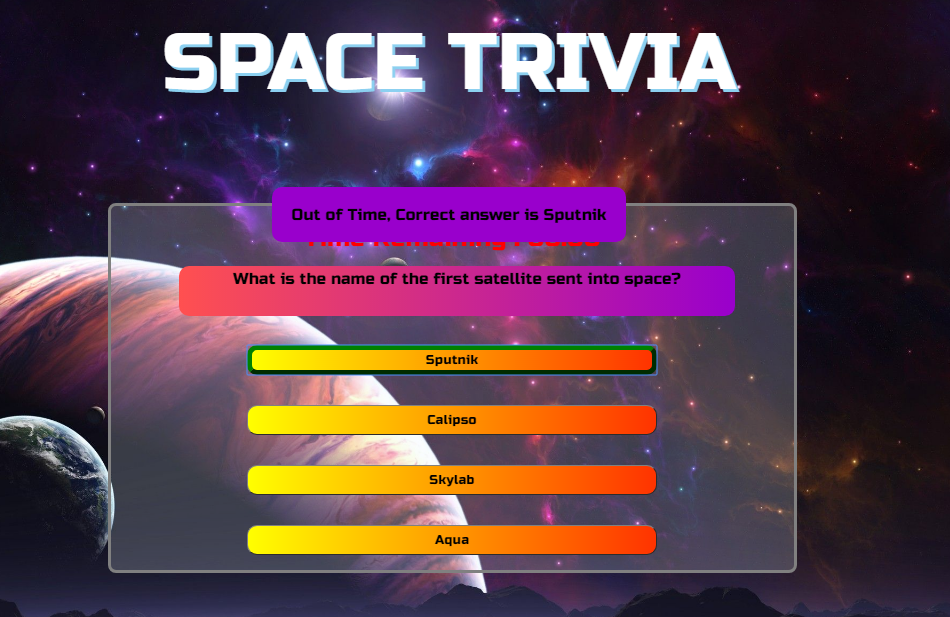

# TriviaGame
**Timed Trivia Game**

###**About**
The main purpose of this project is to develop a trivia game using the timers. The theme of this game is **Space**.

This game will present 13 questions to the user, giving 30 seconds to answer each question. When user has finished answering all the questions it will display the users results. User has the option to start the game again. 
If user doesn’t answer a question within the time period it will pop up the correct answer and move on to the next question. 
If the answer is correct user would be notified with the check marked alert. 
If the answer is incorrect user would be notified with the cross check and the correct answer would be highlighted with  a green border

###**Use**
This game will help user to test his/her knowledge in the subject area of space science

###**Steps**
	* Game starts when the **Play** button is pressed 
	* Each question has 30 seconds to answer
	* Game will check the answer selected and alert the user and navigate to the next question
	* When all questions are answered, results will be displayed
	* User can play the game again or exit the game 

###**Technologies**
	* HTML
	* CSS
	* JavaScript
	* Jquery
	* JavaScript Timer functions

###**Demo Images**

**Game Start**

**User Answered correct**

**User answered incorrect**

**Time out**

**Game Over**

###**Future enhancements**
	* Query question and answers from an API/Database
	* Present set of new random question in every new game
	* Have diffrent categories
	* Multiplayer option
** This project is maintained by Indima Dias. 

